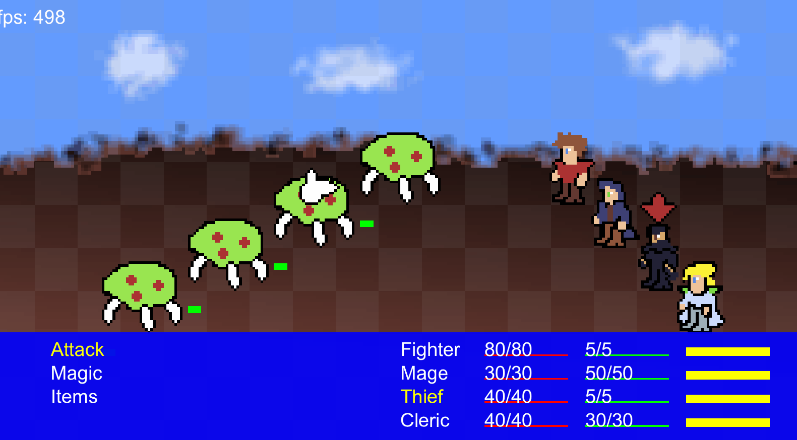

# JRPG Battler 

A prototype JRPG combat simulator written in C where you control a party of four characters as they fight jellyfish monsters. 

Use the J and K keys to navigate the bottom menu (like Vim). Enter will select a command, Tab will go back to the previous menu.
Press space to cycle between characters.

To select a command, a character must have a full time bar. 
## Cool Technical Features
- This game is written in C using the Oogabooga engine for windowing and rendering. Everything else is hand written by me.
- Full replication of the SNES-era time-based JRPG combat system
- Custom pixel art sprites

## Builds 
This project uses a C unity build with Clang to keep things simple. I prefer to leave that purple Windows IDE over at my day job.

### Quickstart
Currently, we only support Windows x64 systems.
1. Make sure Windows SDK is installed
1. Install clang, add to path
1. Clone repo to <project_dir>
1. Run `build.bat`
1. Run build/cgame.exe
1. profit
